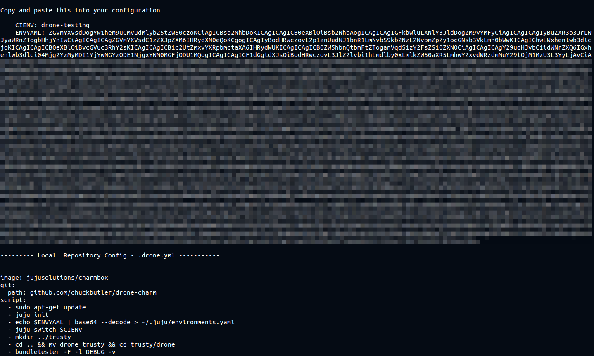
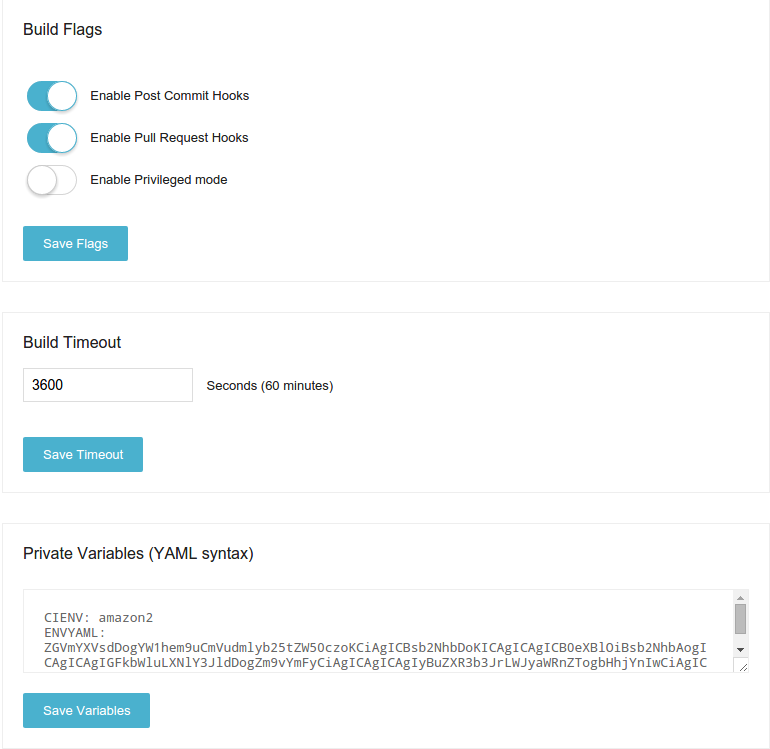

# DRONE CI

Drone is a continuous integration platform built on Docker, written in Golang.

This charm will deploy a single Drone CI server to execute builds against your
git repositories hosted by:

- GitHub
- GitLab
- Gogs
- BitBucket

Drone CI has a flexible job configuration via a single `.drone.yml` include in
your repository. For more information, see the [upstream documentation](https://github.com/drone/drone/blob/v0.2.1/README.md#builds)

## Getting Started with the DroneCI Charm

DroneCI is deployable as a stand alone instance by default, leveraging SQLITE
database, and no external dependencies.

    juju deploy cs:trusty/drone-ci

This charm will pull and configure the latest docker image, install the Drone-CI
binaries, and expose the DroneCI service on port 80.

### Using an external MySQL database

Drone is compatible with MySQL and can be configured to leverage a MySQL database
via relation

    juju deploy mysql
    juju add-relation drone-ci:db mysql:db

#### Config Helper

> This is beta, has very little error checking, and may or may not work given
> the input you feed the script. Please use with caution.

The charm ships with a script to assist in configuring jobs. This is best run
locally

    git clone https://github.com/chuckbutler/drone-ci-charm drone
    cd drone/scripts
    ./config -e {{environment}} -r {{repository https clone url}} -c {{charm name}}

You will receive output that is copy/pasteable to both the drone-ci repository
configuration, and the .drone.yaml to be embedded in the git repository.

## Known Issues / Caveats

#### Auth providers
Drone currently supports several third party AUTH providers, which have not
yet been added to the charm.

#### Upstream Release Schedule / Compatibility
Drone also iterates quickly, and has known to break backwords compatibility
between minor revision numbers (if you follow semver) - as v0.3 (deployed by 
this charm) is not complaint, or upgradeable from v0.2. The charm authors will
continue watching this scenario, and notify the Juju mailing list should this
happen moving forward - so anyone deploying from the Juju Charm will know what
to expect.

#### Scaling
Scaling the service with additional docker workers is not currently supported.

## Upstream Contact Information

- [DroneCI Github Project](https://github.com/drone/drone)
- [DroneCI Issue Tracker](https://github.com/drone/drone/issues)
- [DroneCI Gitter Chat](https://gitter.im/drone/drone)

## Upstream Documentation

- [User Guide](http://readme.drone.io/usage/overview/)
- [API Reference](http://readme.drone.io/api/overview/)
